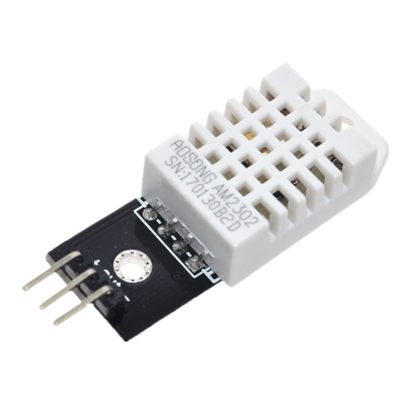
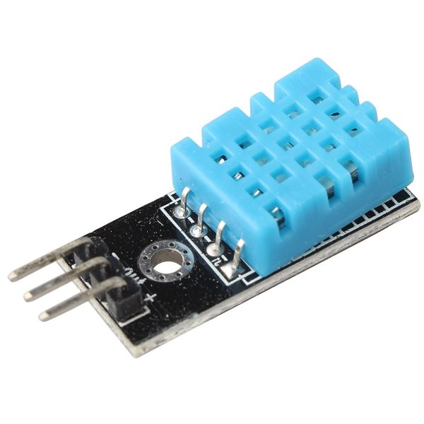
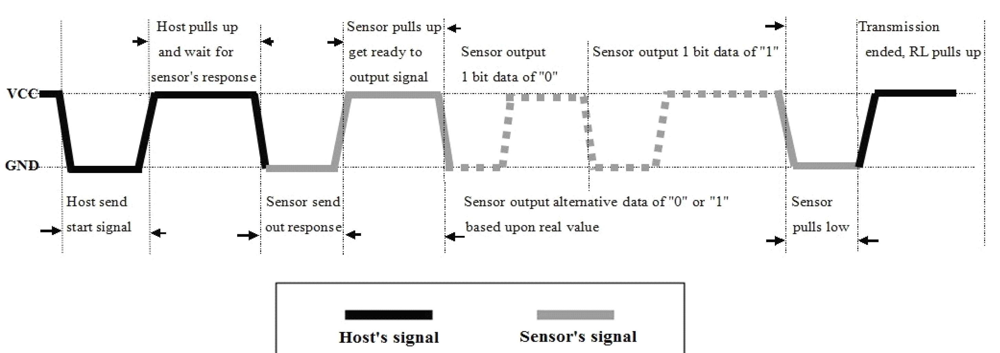

# AVR DHT Sensor Library

A library that uses the DHT22/DHT11 sensor to read in temperature and humidity data using AVR microcontrollers. 



## Introduction

The DHT22 and DHT11 are a pair of basic, low-cost digital temperature and humidity sensors. They both use a capacitive humidity sensor and a thermistor to measure the surrounding air and spit out a digital signal to a single data pin. It's easy to use but requires careful timing to grab data.

There are established libraries for usage with Arduino, but nothing official in use with the AVR family of microcontrollers. This library aims to solve this problem while also providing the end user with an explanation on how it is accomplished.

### Understanding

The DHT family of sensors utilize just a single pin to communicate with an AVR microcontroller. To communicate with the sensor, an interval of timed highs and lows are required to prepare the sensor for data output. The initial process for the DHT22 is displayed below:

<p align="center"> 

  
The provided library does not use interrupts and instead relies on a series of delays provided by #include <util/delay.h>

A total of 40 bits are received from the DHT sensor. The first 16 bits represent the relative humidity in binary, and conversion to a decimal percentage requires dividing by 10. 

For example:

```
0000 0001 1111 0101 = 501 / 10 = 50.1% Relative Humidity
```

The next 16 bits represent the temperature in degree C, which requires the same conversion as above. The last 8 bits represent the checksum, which is lower 8 bits of the sum of the first 3 bytes.

Since the DHT11 sensor does not have decimal level accuracy, the conversion is not used and only the 1st and 3rd bytes are outputted.
 
## Implementation

This code is written for the Atmega 1284 @8Mhz but is configurable to work with any product compatible with AVR-GCC.

Below is an example of how DHT.h can be set up. Defining the utilized pin and sensor time happen at compile-time.

```
//Port where DHT sensor is connected
#define DHT_DDR DDRB
#define DHT_PORT PORTB
#define DHT_PIN PINB
#define DHT_INPUTPIN 0

//Define sensor type
#define DHT_DHT11 0
#define DHT_DHT22 1
#define DHT_TYPE DHT_DHT22
```

### Displaying the data

In the included testbench the data is outputted to a 1602A LCD display. The included libraries for that specific LCD screen are included. The output data is stored two separate 16 bit integers, and displaying to any other LCD should be cake.

Keep in mind the data retrieval process is slow and takes nearly up to 2 seconds for each refresh.

The end result should be something like this:


### Built With

* [Atmel Studio 7](http://www.microchip.com/mplab/avr-support/atmel-studio-7) - integrated development platform used
* [AVRISP mkII](https://www.microchip.com/developmenttools/ProductDetails/atavrisp2) - AVR microcontroller programmer

## Acknowledgments

* Special thanks to Dr. Philip Brisk at UCR for teaching EE/CS 120B which inspired to build this library.
* A lot of this code was adapted for my final project (Lab Chemical Temperature Sensor) which you can find [here](https://drive.google.com/drive/u/1/folders/1jun-SS4S1ZxK5DPT-s2teyDszfePHfHl).

## Questions & Concerns
If you have any questions or concerns, please feel free to email me at [fengcda@gmail.com](mailto:fengcda@gmail.com)
